Below is a sample of data analysis I completed for the final project in my Advanced Spatial Analysis course. 
First- using the `spatstat` package, I checked and analyzed the distribution patterns of Burrowing Owl nests within Prairie Dog colonies using Ripley's K- function and Ripley's L, a transformed version to stabilize the variance. I also identified and demonstrated using `dbscan` as potential tool to identify clusters within the nest points. 
Secondly- I demonstrated some of the issues I had run into with using shapefiles with the `sf` package and share a function I wrote to convert shapefiles of hand-digitized classified landscapes into rasters for preparation to use `landscapemetrics`.
Finally- I calculated and sampled metrics using `landscapemetrics` and briefly demonstrate some of the potential application of these metrics. 


# Data Analysis

## Loading Data

First, load the packages we'll use directly. They'll also load any other packages they're contingent on. 

```r
library(sf)                                  ##for working with spatial data
library(sp)                                  ##predecessor to sf
library(maptools)                            ##for handling polygons in spatstat
library(ggplot2); theme_set(theme_bw())      ##for all maps/plots
library(tidyr)                               ##for data manipulation
library(dplyr)                               ##for data manipulation
library(raster)                              ##for working with rasters
library(terra)                               ##also for working with rasters
library(landscapemetrics)                    ##to calc landscape metrics
library(fasterize)                           ##faster polygon to raster function
library(spatstat)                            ##for point pattern analysis
library(knitr)                               ##for tables
library(kableExtra)                          ##also for tables
library(dbscan)                              ##to assign clusters
library(car)                                 ##for vif
```

### Owls Nests and Prairie Dog Colonies

First we'll load the nest data for two years at one site and bring in the corresponding Prairie Dog colony boundaries. 

```r
##read in nest data
coma10nests <- st_read("Nests/2010/comanchenests.shp")

##coma10 actually has 2009 and 2010 nests so we'll split it
coma09nests <- coma10nests %>% filter(Year == 2009)
coma10nests <- coma10nests %>% filter(Year == 2010)

##pull out projected coordinate system reference to make sure next files are 
##in the same projection
utm13 <- st_crs(coma10nests)

##we'll also add in a shapefile that is the perimeter of the associated 
##prairie dog colonies
##i'll also transform this when I bring it in so the crs is the same
coma09cols <- st_read("Prairie Dog Colonies/2009/comatrack.shp") %>% st_transform(utm13)
coma10cols <- st_read("Prairie Dog Colonies/2010/coma2010tracks.shp") %>% st_transform(utm13)
```


### Prep Data for `spatstat`


```r
##comanche
##define windows for coma using the colonies
c09win <- as.owin(coma09cols$geometry)
c10win <- as.owin(coma10cols$geometry)

##change the nest names/identities into just the year/colony
coma09nests$col <- as.factor(substr(coma09nests$IDENT, 1, 7))
coma10nests$col <- as.factor(substr(coma10nests$IDENT, 1, 7))

##we can check it to see the different levels of colonies
coma10nests$col %>% unique()
```

```
## [1] C10-112 C10-11A C10-14E C10-14M C10-5C- C10-5CA C10-7A- C10-8F-
## Levels: C10-112 C10-11A C10-14E C10-14M C10-5C- C10-5CA C10-7A- C10-8F-
```

```r
##now we turn our nests into point patterns
c09nests <- as.ppp(coma09nests)
c10nests <- as.ppp(coma10nests)

##and "mark" them by colonies
marks(c09nests) <- coma09nests$col
marks(c10nests) <- coma10nests$col

##check that the nests are inside of the windows 
inside.owin(x=c10nests, w = c09win) %>% unique()
```

```
## [1]  TRUE FALSE
```

```r
inside.owin(x=c10nests, w = c10win) %>% unique()
```

```
## [1]  TRUE FALSE
```
So some nests are within the colonies and some aren't. That is fine for the time being so we'll continue. 
We'll attach the corresponding "window" (here the colony boundaries) to the nests.

```r
Window(c09nests) <- c09win
Window(c10nests) <- c10win
```

Now that nests and colonies are in the environment and in the proper formats, I wrote code to caluclate Ripley's K and Ripley's L for my nests using the `spatstat` package. I will also perform Monte-Carlo tests to check for Complete Spatial Randomness (CSR).

## K-Function

```r
##now that data is prepped, we can run ripleys k, 
##we'll specigy the max distance as (1km)
##first for 2009 coma
c09kest <- Kest(c09nests, rmax = 1000)
plot(c09kest)
```

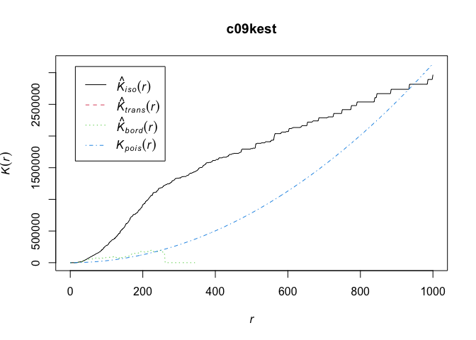<!-- -->

```r
##next for 2010 coma
c10kest <- Kest(c10nests, rmax = 1000)
plot(c10kest)
```

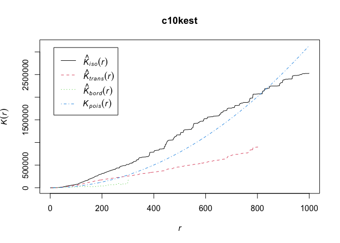<!-- -->

These have some interesting patterns...we'll get into it later. 
Next- we'll calculate the L estimates- since it stabilizes the variance, we might see something a little bit different (or not). 

## L-Function


```r
##first for coma 2009
c09lest <- Lest(c09nests, rmax = 1000)
plot(c09lest)
```

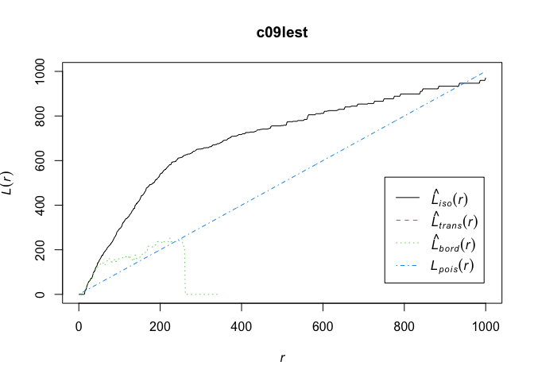<!-- -->

```r
##next for coma 2010
c10lest <- Lest(c10nests, rmax = 1000)
plot(c10lest)
```

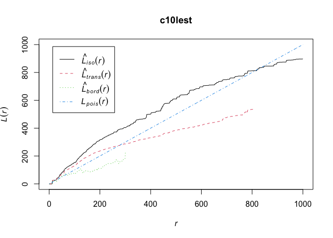<!-- -->

These estimates are just telling us that are patterns suggest clustering at different scales. To say anything with at least some degree of certainty, we must conduct a hypothesis test. We'll perform Monte Carlo tests, which tests hypotheses using simulations and creating confidence envelopes. These tests are conservative, but can be useful. Baddeley et al. 2015. 


## K-Function Hypothesis Testing


```r
##set number of simulations to 39- this gives us 0.05 level of significance
##global is set to false- this make pointwise envelopes
##also set to 600m since we don't care about clusters beyond the size of an avg
##m BUOW home range
c09.k.95ci <- envelope(c09nests, Kest, funargs=list(rmax = 600), nsim=39, global=FALSE)
c09.k.95ci
```

```
## Pointwise critical envelopes for K(r)
## and observed value for 'c09nests'
## Edge correction: "iso"
## Obtained from 39 simulations of CSR
## Alternative: two.sided
## Significance level of pointwise Monte Carlo test: 2/40 = 0.05
## .....................................................................
##      Math.label     Description                                      
## r    r              distance argument r                              
## obs  hat(K)[obs](r) observed value of K(r) for data pattern          
## theo K[theo](r)     theoretical value of K(r) for CSR                
## lo   hat(K)[lo](r)  lower pointwise envelope of K(r) from simulations
## hi   hat(K)[hi](r)  upper pointwise envelope of K(r) from simulations
## .....................................................................
## Default plot formula:  .~r
## where "." stands for 'obs', 'theo', 'hi', 'lo'
## Columns 'lo' and 'hi' will be plotted as shading (by default)
## Recommended range of argument r: [0, 600]
## Available range of argument r: [0, 600]
```

```r
plot(c09.k.95ci)
```

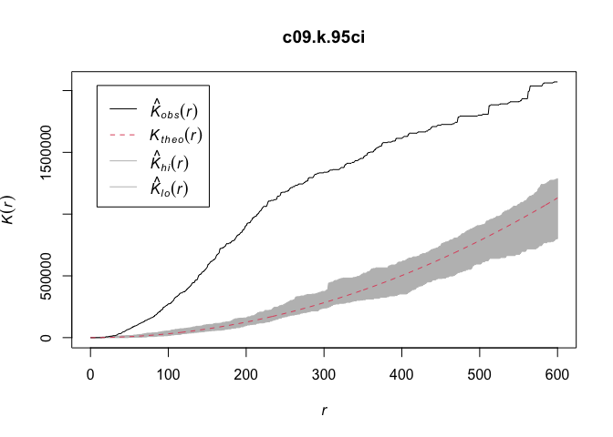<!-- -->

```r
##global set to false makes simultaneous envelopes- better for null rejection
##nsim set to 19 for 0.05 level of significance
c09.k.95ge <- envelope(c09nests, Kest, funargs=list(rmax = 600), nsim=19, global=TRUE)
c09.k.95ge
```

```
## Simultaneous critical envelopes for K(r)
## and observed value for 'c09nests'
## Edge correction: "iso"
## Obtained from 19 simulations of CSR
## Envelope based on maximum deviation of K(r) from null value for CSR (known 
## exactly)
## Alternative: two.sided
## Significance level of simultaneous Monte Carlo test: 1/20 = 0.05
## ...........................................................
##      Math.label     Description                            
## r    r              distance argument r                    
## obs  hat(K)[obs](r) observed value of K(r) for data pattern
## theo K[theo](r)     theoretical value of K(r) for CSR      
## lo   hat(K)[lo](r)  lower critical boundary for K(r)       
## hi   hat(K)[hi](r)  upper critical boundary for K(r)       
## ...........................................................
## Default plot formula:  .~r
## where "." stands for 'obs', 'theo', 'hi', 'lo'
## Columns 'lo' and 'hi' will be plotted as shading (by default)
## Recommended range of argument r: [0, 600]
## Available range of argument r: [0, 600]
```

```r
plot(c09.k.95ge)
```

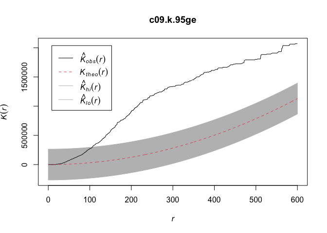<!-- -->

```r
##repeat with coma 2010 nests----
##pointwise confidence intervals
c10.k.95ci <- envelope(c10nests, Kest, funargs=list(rmax = 600), nsim=39, global=FALSE)
c10.k.95ci
```

```
## Pointwise critical envelopes for K(r)
## and observed value for 'c10nests'
## Edge correction: "iso"
## Obtained from 39 simulations of CSR
## Alternative: two.sided
## Significance level of pointwise Monte Carlo test: 2/40 = 0.05
## .....................................................................
##      Math.label     Description                                      
## r    r              distance argument r                              
## obs  hat(K)[obs](r) observed value of K(r) for data pattern          
## theo K[theo](r)     theoretical value of K(r) for CSR                
## lo   hat(K)[lo](r)  lower pointwise envelope of K(r) from simulations
## hi   hat(K)[hi](r)  upper pointwise envelope of K(r) from simulations
## .....................................................................
## Default plot formula:  .~r
## where "." stands for 'obs', 'theo', 'hi', 'lo'
## Columns 'lo' and 'hi' will be plotted as shading (by default)
## Recommended range of argument r: [0, 600]
## Available range of argument r: [0, 600]
```

```r
plot(c10.k.95ci)
```

<!-- -->

```r
##simultaneous/global confidence envelopes
c10.k.95ge <- envelope(c10nests, Kest, funargs=list(rmax = 600), nsim=19, global=TRUE)
c10.k.95ge
```

```
## Simultaneous critical envelopes for K(r)
## and observed value for 'c10nests'
## Edge correction: "iso"
## Obtained from 19 simulations of CSR
## Envelope based on maximum deviation of K(r) from null value for CSR (known 
## exactly)
## Alternative: two.sided
## Significance level of simultaneous Monte Carlo test: 1/20 = 0.05
## ...........................................................
##      Math.label     Description                            
## r    r              distance argument r                    
## obs  hat(K)[obs](r) observed value of K(r) for data pattern
## theo K[theo](r)     theoretical value of K(r) for CSR      
## lo   hat(K)[lo](r)  lower critical boundary for K(r)       
## hi   hat(K)[hi](r)  upper critical boundary for K(r)       
## ...........................................................
## Default plot formula:  .~r
## where "." stands for 'obs', 'theo', 'hi', 'lo'
## Columns 'lo' and 'hi' will be plotted as shading (by default)
## Recommended range of argument r: [0, 600]
## Available range of argument r: [0, 600]
```

```r
plot(c10.k.95ge)
```

<!-- -->

We'll repeat these steps, but with the L-function as it stabilizes variance. We'll also fix the distance to either 250m or 600m- two distances of interest to us.

## L-Function Hypothesis Testing


```r
##coma 2009----
##250m
c09.l250.95ci <- envelope(c09nests, Lest, funargs=list(rmax = 250), nsim=39, global=FALSE)
c09.l250.95ci
```

```
## Pointwise critical envelopes for L(r)
## and observed value for 'c09nests'
## Edge correction: "iso"
## Obtained from 39 simulations of CSR
## Alternative: two.sided
## Significance level of pointwise Monte Carlo test: 2/40 = 0.05
## .....................................................................
##      Math.label     Description                                      
## r    r              distance argument r                              
## obs  hat(L)[obs](r) observed value of L(r) for data pattern          
## theo L[theo](r)     theoretical value of L(r) for CSR                
## lo   hat(L)[lo](r)  lower pointwise envelope of L(r) from simulations
## hi   hat(L)[hi](r)  upper pointwise envelope of L(r) from simulations
## .....................................................................
## Default plot formula:  .~r
## where "." stands for 'obs', 'theo', 'hi', 'lo'
## Columns 'lo' and 'hi' will be plotted as shading (by default)
## Recommended range of argument r: [0, 250]
## Available range of argument r: [0, 250]
```

```r
plot(c09.l250.95ci)
```

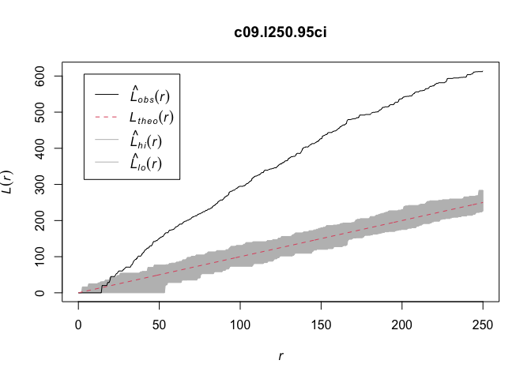<!-- -->

```r
##simultaneous/global confidence envelopes
c09.l250.95ge <- envelope(c09nests, Lest, funargs=list(rmax = 250), nsim=19, global=TRUE)
c09.l250.95ge
```

```
## Simultaneous critical envelopes for L(r)
## and observed value for 'c09nests'
## Edge correction: "iso"
## Obtained from 19 simulations of CSR
## Envelope based on maximum deviation of L(r) from null value for CSR (known 
## exactly)
## Alternative: two.sided
## Significance level of simultaneous Monte Carlo test: 1/20 = 0.05
## ...........................................................
##      Math.label     Description                            
## r    r              distance argument r                    
## obs  hat(L)[obs](r) observed value of L(r) for data pattern
## theo L[theo](r)     theoretical value of L(r) for CSR      
## lo   hat(L)[lo](r)  lower critical boundary for L(r)       
## hi   hat(L)[hi](r)  upper critical boundary for L(r)       
## ...........................................................
## Default plot formula:  .~r
## where "." stands for 'obs', 'theo', 'hi', 'lo'
## Columns 'lo' and 'hi' will be plotted as shading (by default)
## Recommended range of argument r: [0, 250]
## Available range of argument r: [0, 250]
```

```r
plot(c09.l250.95ge)
```

<!-- -->

```r
##600m
##pointwise confidence intervals
c09.l600.95ci <- envelope(c09nests, Lest, funargs=list(rmax = 600), nsim=39, global=FALSE)
c09.l600.95ci
```

```
## Pointwise critical envelopes for L(r)
## and observed value for 'c09nests'
## Edge correction: "iso"
## Obtained from 39 simulations of CSR
## Alternative: two.sided
## Significance level of pointwise Monte Carlo test: 2/40 = 0.05
## .....................................................................
##      Math.label     Description                                      
## r    r              distance argument r                              
## obs  hat(L)[obs](r) observed value of L(r) for data pattern          
## theo L[theo](r)     theoretical value of L(r) for CSR                
## lo   hat(L)[lo](r)  lower pointwise envelope of L(r) from simulations
## hi   hat(L)[hi](r)  upper pointwise envelope of L(r) from simulations
## .....................................................................
## Default plot formula:  .~r
## where "." stands for 'obs', 'theo', 'hi', 'lo'
## Columns 'lo' and 'hi' will be plotted as shading (by default)
## Recommended range of argument r: [0, 600]
## Available range of argument r: [0, 600]
```

```r
plot(c09.l600.95ci)
```

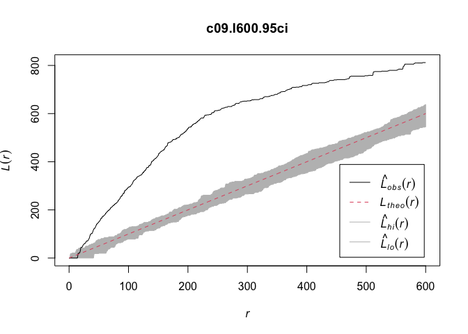<!-- -->

```r
##simultaneous/global confidence envelopes
c09.l600.95ge <- envelope(c10nests, Lest, funargs=list(rmax = 600), nsim=19, global=TRUE)
c09.l600.95ge
```

```
## Simultaneous critical envelopes for L(r)
## and observed value for 'c10nests'
## Edge correction: "iso"
## Obtained from 19 simulations of CSR
## Envelope based on maximum deviation of L(r) from null value for CSR (known 
## exactly)
## Alternative: two.sided
## Significance level of simultaneous Monte Carlo test: 1/20 = 0.05
## ...........................................................
##      Math.label     Description                            
## r    r              distance argument r                    
## obs  hat(L)[obs](r) observed value of L(r) for data pattern
## theo L[theo](r)     theoretical value of L(r) for CSR      
## lo   hat(L)[lo](r)  lower critical boundary for L(r)       
## hi   hat(L)[hi](r)  upper critical boundary for L(r)       
## ...........................................................
## Default plot formula:  .~r
## where "." stands for 'obs', 'theo', 'hi', 'lo'
## Columns 'lo' and 'hi' will be plotted as shading (by default)
## Recommended range of argument r: [0, 600]
## Available range of argument r: [0, 600]
```

```r
plot(c09.l600.95ge)
```

<!-- -->

```r
##coma 2010----
##250m
c10.l250.95ci <- envelope(c10nests, Lest, funargs=list(rmax = 250), nsim=39, global=FALSE)
c10.l250.95ci
```

```
## Pointwise critical envelopes for L(r)
## and observed value for 'c10nests'
## Edge correction: "iso"
## Obtained from 39 simulations of CSR
## Alternative: two.sided
## Significance level of pointwise Monte Carlo test: 2/40 = 0.05
## .....................................................................
##      Math.label     Description                                      
## r    r              distance argument r                              
## obs  hat(L)[obs](r) observed value of L(r) for data pattern          
## theo L[theo](r)     theoretical value of L(r) for CSR                
## lo   hat(L)[lo](r)  lower pointwise envelope of L(r) from simulations
## hi   hat(L)[hi](r)  upper pointwise envelope of L(r) from simulations
## .....................................................................
## Default plot formula:  .~r
## where "." stands for 'obs', 'theo', 'hi', 'lo'
## Columns 'lo' and 'hi' will be plotted as shading (by default)
## Recommended range of argument r: [0, 250]
## Available range of argument r: [0, 250]
```

```r
plot(c10.l250.95ci)
```

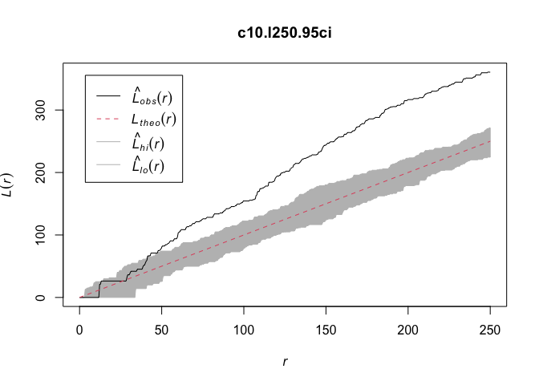<!-- -->

```r
##simultaneous/global confidence envelopes
c10.l250.95ge <- envelope(c10nests, Lest, funargs=list(rmax = 250), nsim=19, global=TRUE)
c10.l250.95ge
```

```
## Simultaneous critical envelopes for L(r)
## and observed value for 'c10nests'
## Edge correction: "iso"
## Obtained from 19 simulations of CSR
## Envelope based on maximum deviation of L(r) from null value for CSR (known 
## exactly)
## Alternative: two.sided
## Significance level of simultaneous Monte Carlo test: 1/20 = 0.05
## ...........................................................
##      Math.label     Description                            
## r    r              distance argument r                    
## obs  hat(L)[obs](r) observed value of L(r) for data pattern
## theo L[theo](r)     theoretical value of L(r) for CSR      
## lo   hat(L)[lo](r)  lower critical boundary for L(r)       
## hi   hat(L)[hi](r)  upper critical boundary for L(r)       
## ...........................................................
## Default plot formula:  .~r
## where "." stands for 'obs', 'theo', 'hi', 'lo'
## Columns 'lo' and 'hi' will be plotted as shading (by default)
## Recommended range of argument r: [0, 250]
## Available range of argument r: [0, 250]
```

```r
plot(c10.l250.95ge)
```

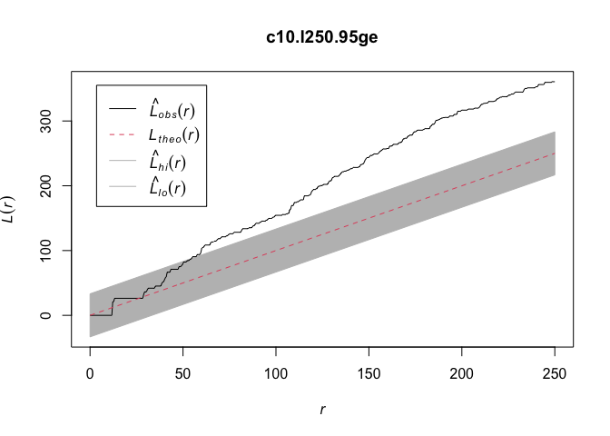<!-- -->

```r
##600m
##pointwise confidence intervals
c10.l600.95ci <- envelope(c10nests, Lest, funargs=list(rmax = 600), nsim=39, global=FALSE)
c10.l600.95ci
```

```
## Pointwise critical envelopes for L(r)
## and observed value for 'c10nests'
## Edge correction: "iso"
## Obtained from 39 simulations of CSR
## Alternative: two.sided
## Significance level of pointwise Monte Carlo test: 2/40 = 0.05
## .....................................................................
##      Math.label     Description                                      
## r    r              distance argument r                              
## obs  hat(L)[obs](r) observed value of L(r) for data pattern          
## theo L[theo](r)     theoretical value of L(r) for CSR                
## lo   hat(L)[lo](r)  lower pointwise envelope of L(r) from simulations
## hi   hat(L)[hi](r)  upper pointwise envelope of L(r) from simulations
## .....................................................................
## Default plot formula:  .~r
## where "." stands for 'obs', 'theo', 'hi', 'lo'
## Columns 'lo' and 'hi' will be plotted as shading (by default)
## Recommended range of argument r: [0, 600]
## Available range of argument r: [0, 600]
```

```r
plot(c10.l600.95ci)
```

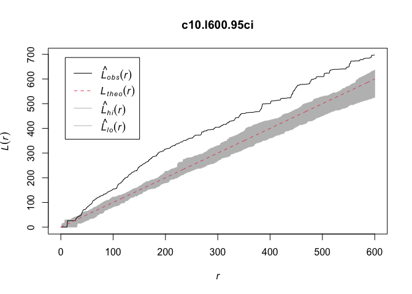<!-- -->

```r
##simultaneous/global confidence envelopes
c10.l600.95ge <- envelope(c10nests, Lest, funargs=list(rmax = 600), nsim=19, global=TRUE)
c10.l600.95ge
```

```
## Simultaneous critical envelopes for L(r)
## and observed value for 'c10nests'
## Edge correction: "iso"
## Obtained from 19 simulations of CSR
## Envelope based on maximum deviation of L(r) from null value for CSR (known 
## exactly)
## Alternative: two.sided
## Significance level of simultaneous Monte Carlo test: 1/20 = 0.05
## ...........................................................
##      Math.label     Description                            
## r    r              distance argument r                    
## obs  hat(L)[obs](r) observed value of L(r) for data pattern
## theo L[theo](r)     theoretical value of L(r) for CSR      
## lo   hat(L)[lo](r)  lower critical boundary for L(r)       
## hi   hat(L)[hi](r)  upper critical boundary for L(r)       
## ...........................................................
## Default plot formula:  .~r
## where "." stands for 'obs', 'theo', 'hi', 'lo'
## Columns 'lo' and 'hi' will be plotted as shading (by default)
## Recommended range of argument r: [0, 600]
## Available range of argument r: [0, 600]
```

```r
plot(c10.l600.95ge)
```

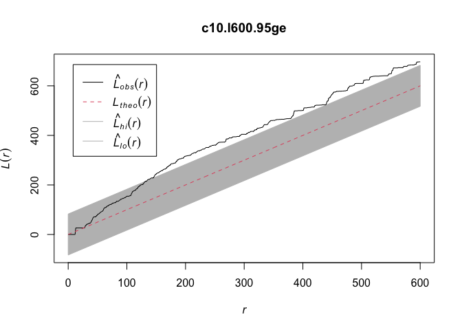<!-- -->

The pointwise envelopes are useful if we are testing a hypothesis at a specifice distance. For example, setting the range to biological meaningful limits would allow us to test better hypothesis. For example, 250m is the limit where clusters have been previously defined while 600m is the distance from burrows at which ~95% of an owl's movements are made. 

## Defining Clusters 

Finally, we'll also investigate our ability to define clusters. We'll use the Density-based spatial clustering of applications with noise (DBSCAN) method. I can do this with the `dbscan` package. 
"This implementation of DBSCAN follows the original algorithm as described by Ester et al (1996). DBSCAN performs the following steps:
1. Estimate the density around each data point by counting the number of points in a user-specified eps-neighborhood and applies a used-specified minPts thresholds to identify core, border and noise points.
2. Core points are joined into a cluster if they are density-reachable (i.e., there is a chain of core points where one falls inside the eps-neighborhood of the next).
3. Border points are assigned to clusters. The algorithm needs parameters eps (the radius of the epsilon neighborhood) and minPts (the density threshold)."


```r
##clustering---
##get just the coordinates of nests
c09coords <- st_coordinates(coma09nests) %>% as.data.frame()
c10coords <- st_coordinates(coma10nests) %>% as.data.frame()

##we set: esp (the size of the espilon neighborhood) and minPts (the min points 
##needed within the neighborhood)
##we'll start with 250m and at least 3 points- prev defined BUOW clusters
c09clust <- dbscan(c09coords, eps = 250, minPts = 3)
plot(c09coords, col=c09clust$cluster)
```

<!-- -->

```r
##add these clusters to the nest data
coma09nests <- coma09nests %>% mutate(clus = c09clust$cluster)

##we can compare the clusters to the colonies
ggplot() + geom_sf(data=coma09nests, aes(color=as.factor(clus)))
```

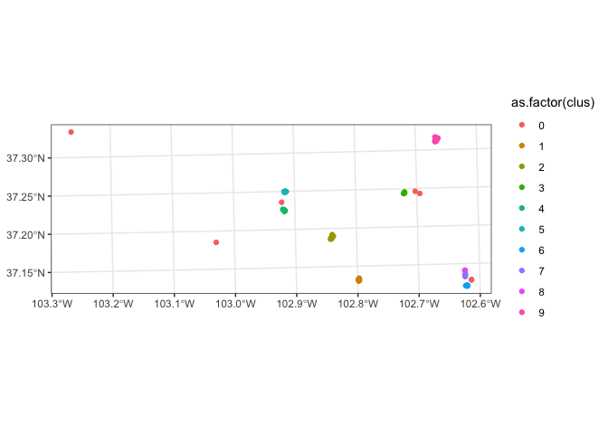<!-- -->

```r
ggplot() + geom_sf(data=coma09nests, aes(color=col))
```

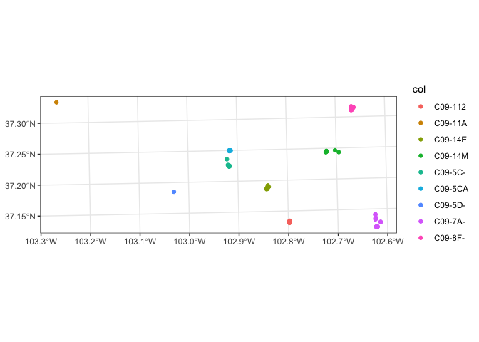<!-- -->

```r
##repeat with 2010 nests----
c10clust <- dbscan(c10coords, eps = 250, minPts = 3)
plot(c10coords, col=c10clust$cluster)
```

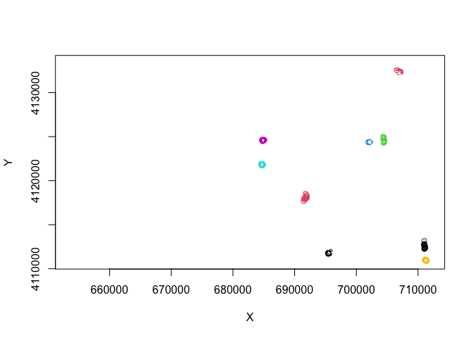<!-- -->

```r
##add new clusters again
coma10nests <- coma10nests %>% mutate(clus = c10clust$cluster)

##more quick maps to compare
ggplot() + geom_sf(data=coma10nests, aes(color=as.factor(clus)))
```

<!-- -->

```r
ggplot() + geom_sf(data=coma10nests, aes(color=col))
```

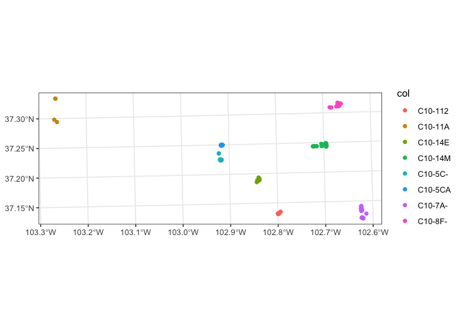<!-- -->


# Future Directions/Next Steps

## Landscape Analysis

When I initially began working with the dataset, I noticed issues with several of the shapefiles of digitized landscape. I was getting errors stating the geometries were invalid, which I was able to rectify. I essentially had to go through each individual shapefile, find the issue, and fix it. There were two issues I encountered:
1. NAs in the data from shapes with only 3 points (the minimum required is 4)
2. Invalid geometry- which can be fixed with the function `st_make_valid()`
Below I've included how I fixed the issues with one of the set of data and loaded in two areas that had no issue. 

### Prepping Data


```r
##BUGA----
##2009
buga09 <- st_read("Digitized Landscapes/2009/BUGAclass2009.shp") %>% st_transform(utm13)
```

```
## Warning in CPL_read_ogr(dsn, layer, query, as.character(options), quiet, : GDAL
## Message 1: organizePolygons() received an unexpected geometry. Either a polygon
## with interior rings, or a polygon with less than 4 points, or a non-Polygon
## geometry. Return arguments as a collection.
```

```
## Warning in CPL_read_ogr(dsn, layer, query, as.character(options), quiet, :
## GDAL Message 1: Geometry of polygon of fid 256 cannot be translated to Simple
## Geometry. All polygons will be contained in a multipolygon.
```

```r
##check for errors and reason
unique(st_is_valid(buga09, reason = T))
```

```
## [1] "Valid Geometry" NA
```

```r
##there are NAs so we have to remove them. find where it is
which(is.na(st_is_valid(buga09)))
```

```
## [1] 257
```

```r
##check what part is wrong
sapply(st_geometry(buga09)[[257]], function(x) nrow(x[[1]]))
```

```
## [1] 490   3  27
```

```r
##the 2nd entry has 3 points, not the required 4
##get just the geometry
b <- st_geometry(buga09) 
##turn problematic part into null
b[[257]][2] = NULL
##replace geometry with corrected one
st_geometry(buga09) = b

##double check it all worked
unique(st_is_valid(buga09, reason = T))
```

```
## [1] "Valid Geometry"
```

```r
##looks like we're all good so we'll keep going

##now do it for 2010
buga10 <- st_read("Digitized Landscapes/2010/BUGAclass.shp") %>% st_transform(utm13)
```

```
## Warning in CPL_read_ogr(dsn, layer, query, as.character(options), quiet, : GDAL
## Message 1: organizePolygons() received an unexpected geometry. Either a polygon
## with interior rings, or a polygon with less than 4 points, or a non-Polygon
## geometry. Return arguments as a collection.
```

```
## Warning in CPL_read_ogr(dsn, layer, query, as.character(options), quiet, :
## GDAL Message 1: Geometry of polygon of fid 191 cannot be translated to Simple
## Geometry. All polygons will be contained in a multipolygon.
```

```r
unique(st_is_valid(buga10))
```

```
## [1] FALSE  TRUE    NA
```

```r
##we don't have NAs but have a false. lets find where
which(st_is_valid(buga10) == FALSE)
```

```
## [1] 1
```

```r
which(is.na(st_is_valid(buga10)))
```

```
## [1] 192
```

```r
##lets assess the problematic geometries- first where invalid
sapply(st_geometry(buga10)[[1]], function(x) nrow(x[[1]]))
```

```
##  [1] 499 420 139 102 232  48 340 200 262 360 671 168 274  62 111   4   7  23 595
## [20] 209
```

```r
##cant see a problem- so st_make_valid() should fix this one for us
##now check the NA
sapply(st_geometry(buga10)[[192]], function(x) nrow(x[[1]]))
```

```
## [1] 490   3  27
```

```r
##the second entry is only 3 points..lets use same remedy as above

##get geometry
b1 <- st_geometry(buga10)
##set problem to null
b1[[192]][2] = NULL
##replace geometry
st_geometry(buga10) = b1

##now fix the false 
buga10 <- st_make_valid(buga10)

##check it all worked right
unique(st_is_valid(buga10))
```

```
## [1] TRUE
```

```r
##COMA----
#2009
coma09 <- st_read("Digitized Landscapes/2009/comaclass2009.shp") %>% st_transform(utm13)
```

```r
unique(st_is_valid(coma09, reason = TRUE))
```

```
## [1] "Valid Geometry"
```

```r
#2010
coma10 <- st_read("Digitized Landscapes/2010/comaclass2010.shp") %>% st_transform(utm13)
unique(st_is_valid(coma09, reason = TRUE))
```

```
## [1] "Valid Geometry"
```

```r
##these landscapes are fine.
```

### Converting Shapefiles to Rasters 

Now that I have shapefiles that worked, I had to figure out how to convert them into rasters for use with the `landscapemetrics` package. I ended up writing a function that takes a sf object and creates a raster (at 1m resolution). It also converts the landscape classes into numeric factors (for analysis) and  checks that the landscape is valid for analysis. I'll continue this part with just the 2009 Comanche NG data. Landscape classes are now: 1: Agriculture, 2: Developed Land, 3: Grassland, 4: Road, 5: Water.


```r
##my function
easyraster <- function(sfobj){
  r <- raster()
  res(r) <- 1
  extent(r) <- extent(sfobj)
  crs(r) <- crs(sfobj)
  sfobj <- sfobj %>% mutate(land = as.numeric(factor(Class)))
  rastnew <- fasterize(sfobj, r, field = "land")
  crs(rastnew) <- crs(sfobj)
  ##also check landscape while we're here
  check_landscape(rastnew) %>% print()
  ##return the new raster
  return(rastnew)
}


##i'll check the names before i run the function- COMA is the only site with 
##different column names
names(coma09)
```

```
## [1] "Id"         "L1"         "L2"         "SHAPE_Leng" "Shape_Le_1"
## [6] "Shape_Area" "geometry"
```

```r
unique(coma09$L1)
```

```
## [1] "Road"        "Developed"   "Agriculture" "Grassland"   "Water"
```

```r
##^this is my class column- so I'll rename it to "Class" for the function
##change names
names(coma09)[2] <- "Class"

##use my function!
c09 <- easyraster(coma09)
```

```
##   layer       crs units   class n_classes OK
## 1     1 projected     m integer         5  ✓
```

```r
##we'll make some plots to check the overlap. have to conver t a df
c09.df <- c09 %>% terra::as.data.frame(xy = TRUE) %>% as_tibble() 

ggplot() + geom_tile(data = c09.df, aes(x, y, fill=layer)) + 
  scale_fill_gradientn(colors = terrain.colors(6, rev=TRUE)) +
  geom_sf(data=coma09nests, aes()) + labs(title="2009")
```

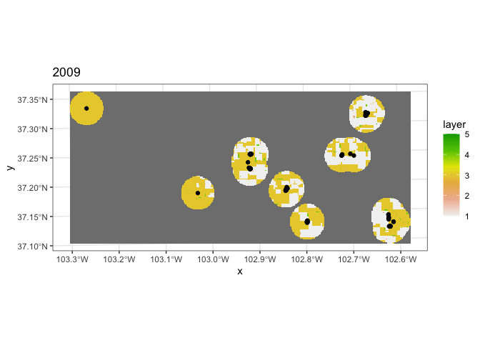<!-- -->

### Calculating Landscape Metrics

We can check to see what metrics can be calculated with this package. It can do ~most~ of the same calculations as FRAGSTATS
We can list them, specifying by "level" aka patch, class, or landscape. 
```r
mlist <- list_lsm(level="landscape")
head(mlist)
```

```
## # A tibble: 6 × 5
##   metric  name              type                 level     function_name
##   <chr>   <chr>             <chr>                <chr>     <chr>        
## 1 ai      aggregation index aggregation metric   landscape lsm_l_ai     
## 2 area_cv patch area        area and edge metric landscape lsm_l_area_cv
## 3 area_mn patch area        area and edge metric landscape lsm_l_area_mn
## 4 area_sd patch area        area and edge metric landscape lsm_l_area_sd
## 5 cai_cv  core area index   core area metric     landscape lsm_l_cai_cv 
## 6 cai_mn  core area index   core area metric     landscape lsm_l_cai_mn
```

It lists abbreviations, full names, the type and the function name. We'll only calculate a handful of them, picking one from each category. 
```r
##check the list types
unique(mlist$type)
```

```
## [1] "aggregation metric"   "area and edge metric" "core area metric"    
## [4] "shape metric"         "complexity metric"    "diversity metric"
```

```r
##make my list of what I want for handy reference
list <- mlist[c(6, 29, 39, 59),]
```

Of these types, I've chosen:
<table>
 <thead>
  <tr>
   <th style="text-align:left;"> metric </th>
   <th style="text-align:left;"> name </th>
   <th style="text-align:left;"> type </th>
   <th style="text-align:left;"> level </th>
   <th style="text-align:left;"> function_name </th>
  </tr>
 </thead>
<tbody>
  <tr>
   <td style="text-align:left;"> cai_mn </td>
   <td style="text-align:left;"> core area index </td>
   <td style="text-align:left;"> core area metric </td>
   <td style="text-align:left;"> landscape </td>
   <td style="text-align:left;"> lsm_l_cai_mn </td>
  </tr>
  <tr>
   <td style="text-align:left;"> ent </td>
   <td style="text-align:left;"> shannon entropy </td>
   <td style="text-align:left;"> complexity metric </td>
   <td style="text-align:left;"> landscape </td>
   <td style="text-align:left;"> lsm_l_ent </td>
  </tr>
  <tr>
   <td style="text-align:left;"> lsi </td>
   <td style="text-align:left;"> landscape shape index </td>
   <td style="text-align:left;"> aggregation metric </td>
   <td style="text-align:left;"> landscape </td>
   <td style="text-align:left;"> lsm_l_lsi </td>
  </tr>
  <tr>
   <td style="text-align:left;"> shdi </td>
   <td style="text-align:left;"> shannon's diversity index </td>
   <td style="text-align:left;"> diversity metric </td>
   <td style="text-align:left;"> landscape </td>
   <td style="text-align:left;"> lsm_l_shdi </td>
  </tr>
</tbody>
</table>


Next, we'll make a list of the metrics we want and use that to calculate them around buffers around each nest. We will maintain nest IDs so that we can join our calculated metrics back to each nest. 

```r
percentage_class <- lsm_c_pland(landscape = c09)

##show core areas of ag(1) and grassland(3). edge depth is 5 pixels
show_cores(landscape = c09, class = c(1, 3), edge_depth = 5, labels = FALSE)
```


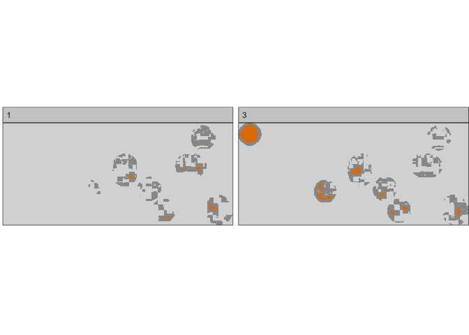<!-- -->

We can also display certain metrics. Here we'll look at the patch area of the agriculture (1) and grassland(3) categories. 
```r
##ag(1) and grassland(3)
show_lsm(landscape = c09, class = c(1, 3), what = "lsm_p_area", labels = FALSE)
```


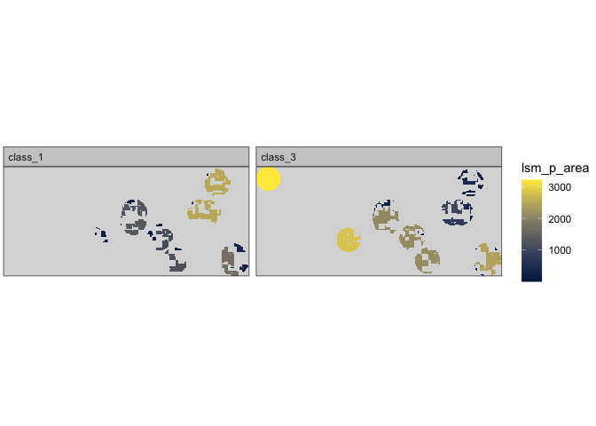<!-- -->

Now, I'll same the selected metrics across the landscape within 600m of each nest point, with "plot_id" set to correspond to the identity of each individual nest so that the data can be combine later. 

```r
c09metrics <- sample_lsm(c09, coma09nests, shape="circle", size = 600, plot_id = coma09nests$IDENT,
           what = c("lsm_l_cai_mn", "lsm_l_ed", "lsm_l_ent", "lsm_l_lsi", 
                    "lsm_l_shdi"), classes_max = 5, verbose = TRUE)

##now we have a list of landscape level metrics sampled within 600m of each nest
##check it quickly
head(c09metrics)
```

```
## # A tibble: 6 × 8
##   layer level     class    id metric  value plot_id     percentage_inside
##   <int> <chr>     <int> <int> <chr>   <dbl> <chr>                   <dbl>
## 1     1 landscape    NA    NA cai_mn 18.6   C09-112-403             104. 
## 2     1 landscape    NA    NA ed     17.5   C09-112-403             104. 
## 3     1 landscape    NA    NA ent     0.987 C09-112-403             104. 
## 4     1 landscape    NA    NA lsi     1.62  C09-112-403             104. 
## 5     1 landscape    NA    NA shdi    0.686 C09-112-403             104. 
## 6     1 landscape    NA    NA cai_mn 16.7   C09-112-404              96.5
```

The data must be rearranged to match the nest points. The nest points are set up such that each nest is a row. Below I rearrange the metrics then join them to the corresponding nests, matched up by "IDENT" in the nest points and "plot_id" in the landscape metrics. 

```r
##rearrange the data such that the metrics are their own columns with their values 
nestmetrics <- c09metrics %>% group_by(plot_id) %>% spread(metric, value)

#combine nest with metrics by nest IDs
##still works even tho the names are different, we just have to specify that
coma09nests_full <- left_join(coma09nests, nestmetrics, by=c("IDENT" = "plot_id"))
```


### Comparing Landscape Metrics and Clusters

Now we'll just do some simple binary logistic regression to compare landscape metrics between our the decision to cluster or not.


```r
hist(coma09nests_full$cai_mn)
```

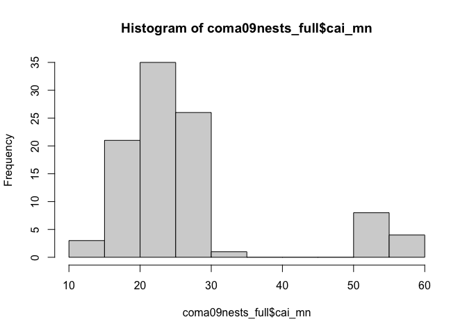<!-- -->

```r
hist(coma09nests_full$ed)
```

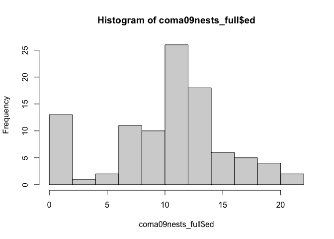<!-- -->

```r
hist(coma09nests_full$lsi)
```

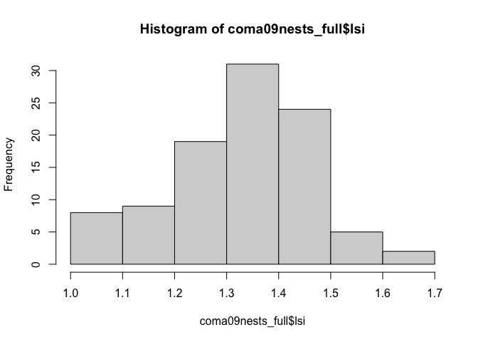<!-- -->

```r
hist(coma09nests_full$ent)
```

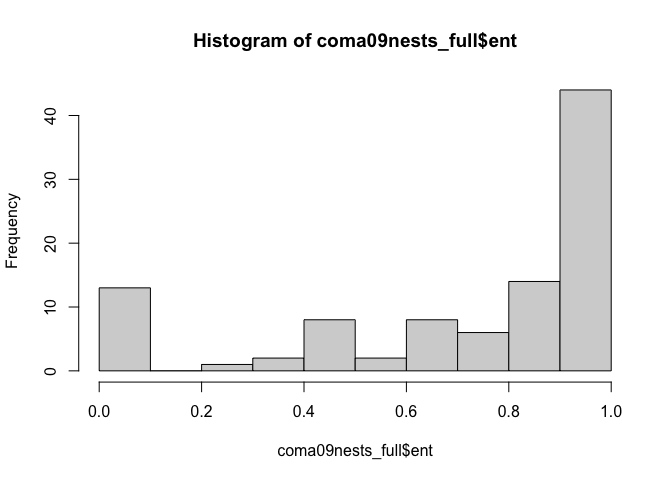<!-- -->

```r
hist(coma09nests_full$shdi)
```

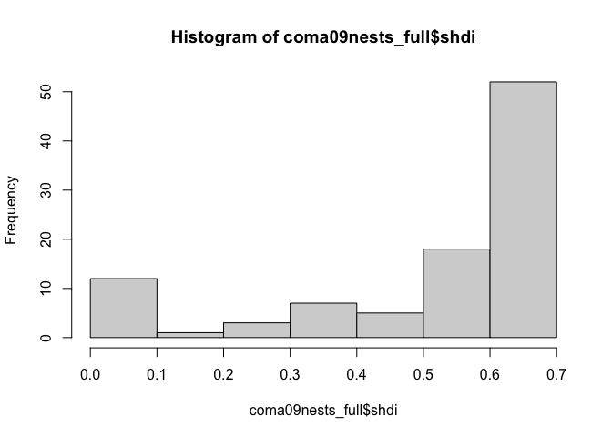<!-- -->

```r
##only lsi looks like it could be normally distributed..


##make new variable- cluster or not. then logistic regression
##where 0 is not in a cluster and 1 is in a cluster
coma09nests_full$clustnoclust <- ifelse(coma09nests_full$clus == 0, 0, 1)


##explore some of the potential combinations for models
glm1 <- glm(clustnoclust ~ cai_mn + ed + lsi + ent + shdi, data = coma09nests_full,
            family = binomial(link = "logit"))
vif(glm1)
```

```
##     cai_mn         ed        lsi        ent       shdi 
##  175.74204   37.41912   13.92406 3982.50924 5267.60106
```

```r
glm2 <- glm(clustnoclust ~ cai_mn + ed + lsi, data = coma09nests_full,
            family = binomial(link = "logit"))
vif(glm2)
```

```
##   cai_mn       ed      lsi 
## 4.129065 9.072556 6.300000
```

```r
glm3 <- glm(clustnoclust ~ cai_mn + lsi, data = coma09nests_full,
            family = binomial(link = "logit"))
vif(glm3)
```

```
##   cai_mn      lsi 
## 3.277218 3.277218
```

```r
glm4 <- glm(clustnoclust ~ cai_mn + ed, data = coma09nests_full,
            family = binomial(link = "logit"))
vif(glm4)
```

```
##   cai_mn       ed 
## 4.222064 4.222064
```

```r
glm5 <- glm(clustnoclust ~ ed + lsi, data =coma09nests_full,
            family = binomial(link = "logit"))
vif(glm5)
```

```
##       ed      lsi 
## 6.251615 6.251615
```

```r
##simple model table
library(sjPlot)
tab_model(glm2, glm3, glm4, glm5, show.aicc = T, digits = 2)
```

<table style="border-collapse:collapse; border:none;">
<tr>
<th style="border-top: double; text-align:center; font-style:normal; font-weight:bold; padding:0.2cm;  text-align:left; ">&nbsp;</th>
<th colspan="3" style="border-top: double; text-align:center; font-style:normal; font-weight:bold; padding:0.2cm; ">clustnoclust</th>
<th colspan="3" style="border-top: double; text-align:center; font-style:normal; font-weight:bold; padding:0.2cm; ">clustnoclust</th>
<th colspan="3" style="border-top: double; text-align:center; font-style:normal; font-weight:bold; padding:0.2cm; ">clustnoclust</th>
<th colspan="3" style="border-top: double; text-align:center; font-style:normal; font-weight:bold; padding:0.2cm; ">clustnoclust</th>
</tr>
<tr>
<td style=" text-align:center; border-bottom:1px solid; font-style:italic; font-weight:normal;  text-align:left; ">Predictors</td>
<td style=" text-align:center; border-bottom:1px solid; font-style:italic; font-weight:normal;  ">Odds Ratios</td>
<td style=" text-align:center; border-bottom:1px solid; font-style:italic; font-weight:normal;  ">CI</td>
<td style=" text-align:center; border-bottom:1px solid; font-style:italic; font-weight:normal;  ">p</td>
<td style=" text-align:center; border-bottom:1px solid; font-style:italic; font-weight:normal;  ">Odds Ratios</td>
<td style=" text-align:center; border-bottom:1px solid; font-style:italic; font-weight:normal;  ">CI</td>
<td style=" text-align:center; border-bottom:1px solid; font-style:italic; font-weight:normal;  col7">p</td>
<td style=" text-align:center; border-bottom:1px solid; font-style:italic; font-weight:normal;  col8">Odds Ratios</td>
<td style=" text-align:center; border-bottom:1px solid; font-style:italic; font-weight:normal;  col9">CI</td>
<td style=" text-align:center; border-bottom:1px solid; font-style:italic; font-weight:normal;  0">p</td>
<td style=" text-align:center; border-bottom:1px solid; font-style:italic; font-weight:normal;  1">Odds Ratios</td>
<td style=" text-align:center; border-bottom:1px solid; font-style:italic; font-weight:normal;  2">CI</td>
<td style=" text-align:center; border-bottom:1px solid; font-style:italic; font-weight:normal;  3">p</td>
</tr>
<tr>
<td style=" padding:0.2cm; text-align:left; vertical-align:top; text-align:left; ">(Intercept)</td>
<td style=" padding:0.2cm; text-align:left; vertical-align:top; text-align:center;  ">35.30</td>
<td style=" padding:0.2cm; text-align:left; vertical-align:top; text-align:center;  ">0.00&nbsp;&ndash;&nbsp;856550109.81</td>
<td style=" padding:0.2cm; text-align:left; vertical-align:top; text-align:center;  ">0.669</td>
<td style=" padding:0.2cm; text-align:left; vertical-align:top; text-align:center;  ">0.73</td>
<td style=" padding:0.2cm; text-align:left; vertical-align:top; text-align:center;  ">0.00&nbsp;&ndash;&nbsp;2126831.09</td>
<td style=" padding:0.2cm; text-align:left; vertical-align:top; text-align:center;  col7">0.967</td>
<td style=" padding:0.2cm; text-align:left; vertical-align:top; text-align:center;  col8">2.87</td>
<td style=" padding:0.2cm; text-align:left; vertical-align:top; text-align:center;  col9">0.02&nbsp;&ndash;&nbsp;1729.70</td>
<td style=" padding:0.2cm; text-align:left; vertical-align:top; text-align:center;  0">0.710</td>
<td style=" padding:0.2cm; text-align:left; vertical-align:top; text-align:center;  1">30.30</td>
<td style=" padding:0.2cm; text-align:left; vertical-align:top; text-align:center;  2">0.00&nbsp;&ndash;&nbsp;337068363.48</td>
<td style=" padding:0.2cm; text-align:left; vertical-align:top; text-align:center;  3">0.660</td>
</tr>
<tr>
<td style=" padding:0.2cm; text-align:left; vertical-align:top; text-align:left; ">cai mn</td>
<td style=" padding:0.2cm; text-align:left; vertical-align:top; text-align:center;  ">1.00</td>
<td style=" padding:0.2cm; text-align:left; vertical-align:top; text-align:center;  ">0.88&nbsp;&ndash;&nbsp;1.11</td>
<td style=" padding:0.2cm; text-align:left; vertical-align:top; text-align:center;  ">0.961</td>
<td style=" padding:0.2cm; text-align:left; vertical-align:top; text-align:center;  ">0.96</td>
<td style=" padding:0.2cm; text-align:left; vertical-align:top; text-align:center;  ">0.87&nbsp;&ndash;&nbsp;1.06</td>
<td style=" padding:0.2cm; text-align:left; vertical-align:top; text-align:center;  col7">0.400</td>
<td style=" padding:0.2cm; text-align:left; vertical-align:top; text-align:center;  col8">1.00</td>
<td style=" padding:0.2cm; text-align:left; vertical-align:top; text-align:center;  col9">0.88&nbsp;&ndash;&nbsp;1.11</td>
<td style=" padding:0.2cm; text-align:left; vertical-align:top; text-align:center;  0">0.974</td>
<td style=" padding:0.2cm; text-align:left; vertical-align:top; text-align:center;  1"></td>
<td style=" padding:0.2cm; text-align:left; vertical-align:top; text-align:center;  2"></td>
<td style=" padding:0.2cm; text-align:left; vertical-align:top; text-align:center;  3"></td>
</tr>
<tr>
<td style=" padding:0.2cm; text-align:left; vertical-align:top; text-align:left; ">ed</td>
<td style=" padding:0.2cm; text-align:left; vertical-align:top; text-align:center;  ">1.30</td>
<td style=" padding:0.2cm; text-align:left; vertical-align:top; text-align:center;  ">0.81&nbsp;&ndash;&nbsp;2.15</td>
<td style=" padding:0.2cm; text-align:left; vertical-align:top; text-align:center;  ">0.278</td>
<td style=" padding:0.2cm; text-align:left; vertical-align:top; text-align:center;  "></td>
<td style=" padding:0.2cm; text-align:left; vertical-align:top; text-align:center;  "></td>
<td style=" padding:0.2cm; text-align:left; vertical-align:top; text-align:center;  col7"></td>
<td style=" padding:0.2cm; text-align:left; vertical-align:top; text-align:center;  col8">1.23</td>
<td style=" padding:0.2cm; text-align:left; vertical-align:top; text-align:center;  col9">0.89&nbsp;&ndash;&nbsp;1.73</td>
<td style=" padding:0.2cm; text-align:left; vertical-align:top; text-align:center;  0">0.210</td>
<td style=" padding:0.2cm; text-align:left; vertical-align:top; text-align:center;  1">1.31</td>
<td style=" padding:0.2cm; text-align:left; vertical-align:top; text-align:center;  2">0.90&nbsp;&ndash;&nbsp;2.00</td>
<td style=" padding:0.2cm; text-align:left; vertical-align:top; text-align:center;  3">0.182</td>
</tr>
<tr>
<td style=" padding:0.2cm; text-align:left; vertical-align:top; text-align:left; ">lsi</td>
<td style=" padding:0.2cm; text-align:left; vertical-align:top; text-align:center;  ">0.10</td>
<td style=" padding:0.2cm; text-align:left; vertical-align:top; text-align:center;  ">0.00&nbsp;&ndash;&nbsp;111708.94</td>
<td style=" padding:0.2cm; text-align:left; vertical-align:top; text-align:center;  ">0.750</td>
<td style=" padding:0.2cm; text-align:left; vertical-align:top; text-align:center;  ">25.23</td>
<td style=" padding:0.2cm; text-align:left; vertical-align:top; text-align:center;  ">0.00&nbsp;&ndash;&nbsp;612027.65</td>
<td style=" padding:0.2cm; text-align:left; vertical-align:top; text-align:center;  col7">0.504</td>
<td style=" padding:0.2cm; text-align:left; vertical-align:top; text-align:center;  col8"></td>
<td style=" padding:0.2cm; text-align:left; vertical-align:top; text-align:center;  col9"></td>
<td style=" padding:0.2cm; text-align:left; vertical-align:top; text-align:center;  0"></td>
<td style=" padding:0.2cm; text-align:left; vertical-align:top; text-align:center;  1">0.10</td>
<td style=" padding:0.2cm; text-align:left; vertical-align:top; text-align:center;  2">0.00&nbsp;&ndash;&nbsp;108088.46</td>
<td style=" padding:0.2cm; text-align:left; vertical-align:top; text-align:center;  3">0.751</td>
</tr>
<tr>
<td style=" padding:0.2cm; text-align:left; vertical-align:top; text-align:left; padding-top:0.1cm; padding-bottom:0.1cm; border-top:1px solid;">Observations</td>
<td style=" padding:0.2cm; text-align:left; vertical-align:top; padding-top:0.1cm; padding-bottom:0.1cm; text-align:left; border-top:1px solid;" colspan="3">98</td>
<td style=" padding:0.2cm; text-align:left; vertical-align:top; padding-top:0.1cm; padding-bottom:0.1cm; text-align:left; border-top:1px solid;" colspan="3">98</td>
<td style=" padding:0.2cm; text-align:left; vertical-align:top; padding-top:0.1cm; padding-bottom:0.1cm; text-align:left; border-top:1px solid;" colspan="3">98</td>
<td style=" padding:0.2cm; text-align:left; vertical-align:top; padding-top:0.1cm; padding-bottom:0.1cm; text-align:left; border-top:1px solid;" colspan="3">98</td>
</tr>
<tr>
<td style=" padding:0.2cm; text-align:left; vertical-align:top; text-align:left; padding-top:0.1cm; padding-bottom:0.1cm;">R<sup>2</sup> Tjur</td>
<td style=" padding:0.2cm; text-align:left; vertical-align:top; padding-top:0.1cm; padding-bottom:0.1cm; text-align:left;" colspan="3">0.114</td>
<td style=" padding:0.2cm; text-align:left; vertical-align:top; padding-top:0.1cm; padding-bottom:0.1cm; text-align:left;" colspan="3">0.107</td>
<td style=" padding:0.2cm; text-align:left; vertical-align:top; padding-top:0.1cm; padding-bottom:0.1cm; text-align:left;" colspan="3">0.113</td>
<td style=" padding:0.2cm; text-align:left; vertical-align:top; padding-top:0.1cm; padding-bottom:0.1cm; text-align:left;" colspan="3">0.113</td>
</tr>
<tr>
<td style=" padding:0.2cm; text-align:left; vertical-align:top; text-align:left; padding-top:0.1cm; padding-bottom:0.1cm;">AICc</td>
<td style=" padding:0.2cm; text-align:left; vertical-align:top; padding-top:0.1cm; padding-bottom:0.1cm; text-align:left;" colspan="3">51.014</td>
<td style=" padding:0.2cm; text-align:left; vertical-align:top; padding-top:0.1cm; padding-bottom:0.1cm; text-align:left;" colspan="3">50.049</td>
<td style=" padding:0.2cm; text-align:left; vertical-align:top; padding-top:0.1cm; padding-bottom:0.1cm; text-align:left;" colspan="3">48.942</td>
<td style=" padding:0.2cm; text-align:left; vertical-align:top; padding-top:0.1cm; padding-bottom:0.1cm; text-align:left;" colspan="3">48.842</td>
</tr>

</table>

```r
##summary of model with lowest AICc
summary(glm5)
```

```
## 
## Call:
## glm(formula = clustnoclust ~ ed + lsi, family = binomial(link = "logit"), 
##     data = coma09nests_full)
## 
## Deviance Residuals: 
##     Min       1Q   Median       3Q      Max  
## -2.7907   0.1870   0.2705   0.3544   0.8578  
## 
## Coefficients:
##             Estimate Std. Error z value Pr(>|z|)
## (Intercept)   3.4113     7.7490   0.440    0.660
## ed            0.2672     0.2004   1.333    0.182
## lsi          -2.2541     7.1115  -0.317    0.751
## 
## (Dispersion parameter for binomial family taken to be 1)
## 
##     Null deviance: 50.434  on 97  degrees of freedom
## Residual deviance: 42.587  on 95  degrees of freedom
## AIC: 48.587
## 
## Number of Fisher Scoring iterations: 6
```
 
