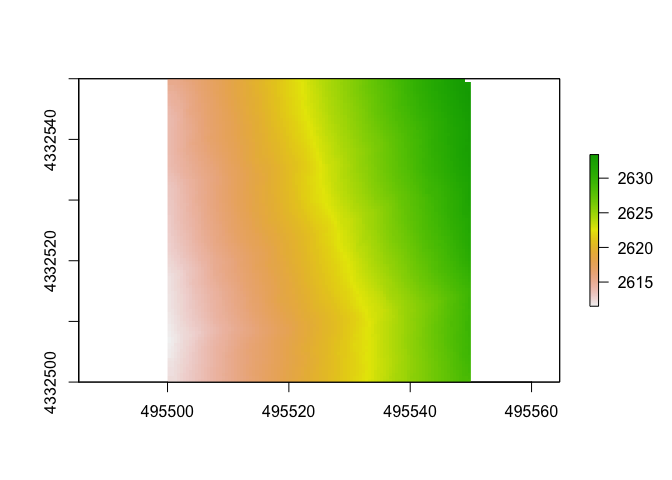
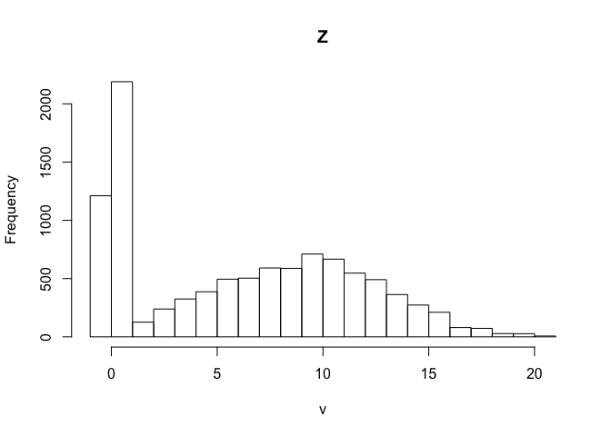
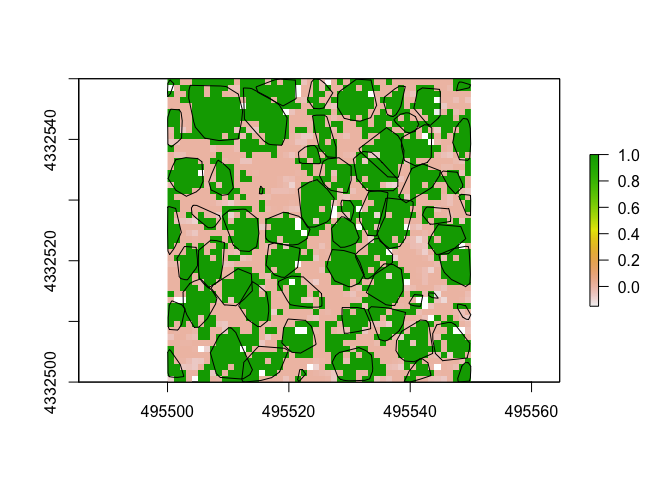

# About this Document

Below is a sample of a workshop I began writing to share a project I began working on in early 2019. While this was never presented, it was a way for me to document and save a sample of the code I was writing as I worked through processing a LiDAR dataset. Rather than completing these steps in GIS-specific programs that I was familiar with, I used these data as my introduction to the use of R for spatial analyses. 


# Load Packages
The first thing we will want to do is set the working directory and load our packages. 
Note that loading lidR will also automatically load "raster" and "sp"—two packages that help visualize and process spatial data. rgdal is another one that helps deal with spatial data, we will use it to export our trees. Loading lidR will also load sp and something else that are both important to do stuff. 

Check the working directory and make sure it is set to where your data is! 
```r 
getwd()
```

```r
library(lidR)
library(rgdal)
library(sp)
```

Next we will load our lidar data, clip it to a smaller sample area, and plot it. Find the las file should be saved in a folder within the directory, as you should always set the directory when working in R. 
We'll bring in our las file and clip it to a much smaller extent. This will make things a bit easier to work with as functions for example will run a lot faster.

# Import Data

The las file we'll be using today was downloaded off the [USGS National Map](https://viewer.nationalmap.gov/basic/?basemap=b1&category=ned,nedsrc&title=3DEP%20View) with data from the [3D Elevation Program](https://www.usgs.gov/core-science-systems/ngp/3dep). Click these links to learn more about the 3DEP program or find some of your own data!

This las file are tiles from Central Colorado. It is projected to NAD83, UTM 13N so the unit of coordinates and elevation values are meters.

*Note that I changed/reprojected the dataset to be in accordance with other data we have, hence the name "projected.las"*

```r
las <- readLAS("data/projected.las")
```

```
## Warning: There are 5095 points flagged 'withheld'.
```

```r
las <- lasclipRectangle(las, 495500, 4332500, 495550, 4332550)
plot(las)
```

With `lidR`, the plot function will open a window that allows you to zoom and pan through your data! Pretty neat!

# Make a DTM

Next, we will make a DTM, or digital terrain model. This is a type of DEM (digital elevation model) that will be generated from only points classified as "ground" within the point cloud.
Let's set the resolution to 0.5m. 

There are different algorithms used to do this, but we will pick just the classic "tin" where things are interpolated from a Delaunay triangulation and extrapolated from nearest neighbors. The command "grid_terrain" can also use other spatial interpolation algorthims such as a point to raster (p2r) or kriging (kriging) or k-nearest neighbor (knnidw). For each of these algorithms, there is an auto input but you can set your own input arguments. 


```r
dtm1 <- grid_terrain(las, res = 0.5, algorithm = tin())
plot(dtm1)
```

<!-- -->


# Make a CHM

To make a CHM, or canopy height model, we will first "normalize" the dataset. The lasnormalize command will subtract the DTM we just made from the lidar point cloud. This will effectively remove topography and ground will be set to 0. Don't worry the original z values will be kept, and will be in a new attribute (Zref) in case you'd like to go back to original elevations. You can also use the command "lasunormalize" to do this automatically.
Now, z values will reflect the distance from the ground rather than elevation above sea level. This will be useful for determining tree heighs from the CHM we create. To create the CHM, we will use two different algorthithms. The first will use point densities?? and the second will use a similar method of triangulation that we used to generate the DTM. 


```r
las <- lasnormalize(las, dtm1)
chm <- grid_canopy(las, res = 0.5, p2r(0.3))
chm1 <- grid_canopy(las, res = 0.5, dsmtin())
```

Now let's look at plot the chm using the point to raster method.

```r
plot(chm)
```

<!-- -->

And now the chm created using a TIN method.

```r
plot(chm1)
```

<!-- -->


**How these look different?**

Another way to look at tree heights is by looking the histograms. With the base `hist()` function, we can look at the distribution of heights above ground across the rasters.

Point to raster chm:

```r
hist(chm)
```

<!-- -->

TIN chm: 

```r
hist(chm1)
```

<!-- -->

**So, can you see any differences between the different algorithms used to calculate the CHM?**
Notice that the first one generated many points below 0!!! This is a big red flag! 

# Tree Segmentation

There are a two approaches people take to doing this, with the CHM or directly from the point cloud. For each of those two methods, there are multiple algorithms and methods to do it. In lidR, lastrees will return a point cloud with trees segemented regardless of method/algorithm used. Today we will generate trees from within the point cloud, again naming the object the same as the file to just add a new field of 'treeID' rather than taking up precious space and making a new point cloud. 

## From the Point Cloud

There are various methods to segment trees using the `lidR` package. This method below for example was adapted from Li et al. 2012 [^1]. 


```r
las <- lastrees(las, li2012(), attribute = "treeID")
```

Now each point in the point cloud has a number for which tree it belongs to! 

## From the CHM

Another way is to use the CHM. We can detect the tops of the trees and use it in conjuction with the CHM to determine where trees are. 
First we'll pull out the tree tops. With this, we can also adjust the size of our moving window. 

```r
ttops <- tree_detection(chm, lmf(4, 2))
plot(chm)                 ##plot the CHM
plot(ttops, add=TRUE)     ##add in the tree tops
```

<!-- -->

**Do the tree tops (+ on plot) seemingly match up with what we can visually parse out as trees from the CHM?**

Now that we have the tops of tree identified, we can use a method adapted from Dalponte and Coomes 2016 [^2]. 

```r
las <- lastrees(las, dalponte2016(chm, ttops))   ##not run
```

Finally, inside the `lidR` package, there are a few other algorithms that you can use such as `silva2016()` or `watershed()` that also use rasters. 

I highly reccomend diving deeper into each method to determine which is appropriate for your data.  


# Raster From Point Heights
Another way we can generate a DTM is by using the 95th percentile of heights of points. We will first calculated a set of standard metrics (although you can customize and calculate your own) and then subset the data. The standard 


```r
m3 <- grid_metrics3d(las, .stdmetrics_z, res=1)
```

```
## Warning: 'grid_metrics3d' is deprecated.
## Use 'voxel_metrics' instead.
## See help("Deprecated")
```

```r
summary(m3$zmean)
```

```
##    Min. 1st Qu.  Median    Mean 3rd Qu.    Max. 
##  -0.150   0.035   5.982   5.767   9.660  20.250
```

```r
summary(m3$zsd)
```

```
##    Min. 1st Qu.  Median    Mean 3rd Qu.    Max.    NA's 
##   0.000   0.014   0.055   0.106   0.140   0.693    3207
```

```r
summary(m3$zentropy)
```

```
##    Min. 1st Qu.  Median    Mean 3rd Qu.    Max.    NA's 
##  0.0000  0.0000  0.0000  0.0448  0.0000  0.6309    2148
```

As you can see, there are a variety of metrics that can be automatically calculated. You can also write your own functions to use to calculate specific metrics you may be interested in.


```r
xy1 <- subset(m3[,1:2])      ##subset xy coords
z95 <- subset(m3[,30])       ##subset z coords
xyz1 <- cbind(xy1, z95)      ##combine xyz coords
raster1 <- rasterFromXYZ(xyz1, res = c(1, 1), crs = "+proj=utm +zone=13 +datum=NAD83")
plot(raster1)
```

<!-- -->

# Other Functions

There are a bunch of other cool things one can calculate and analyze using these data. Here I'll share a couple that I thought were cool/interesting/potentially very valuable!

## Tree Area/Volume

To calculate the area and volume of individual trees we have segmented, we will used a function that calculates the hull of each segmented tree. In lidR, there are 3 options for method used to calculate this: convex, concave, or bounding box (bbox). The default will be convex. If you select concave, you can specify concavity and a threshold for lengths of each segment. You can leave the "attribute" argument as the deafult (attribute = "treeID") as this is the name of the field we used when we segmented trees. 

*Also note: if you'd like to calculate tree hulls using the concave formula, you must download and turn on the "concaveman" package.*


```r
convex_hulls <- tree_hulls(las)       ##calculate area of tree
plot(convex_hulls)                    ##plot tree area
```

<!-- -->

```r
##sample of other methods
bbox_hulls <- tree_hulls(las, type = c("bbox")) 
```

Here the plot above shows the convex hulls of the trees, but as viewed from above and only in 2D. This object `convex_hulls` does include stored within it the calculated area of the generated polygons.

## Rumple Index

The rumple index is a common metric used to calculate the "roughness" of an area by calculating the ratio of the area and the projected area of the ground. Accorindg to the `help("rumple_index")`:    
> "Computes the roughness of a surface as the ratio between its area and its projected area on the ground. If the input is a gridded object (lasmetric or raster) the function computes the surfaces using Jenness's algorithm (see references). If the input is a point cloud the function uses a Delaunay triangulation of the points and computes the area of each triangle."

Here we will use a CHM we generated earlier as the input. This means the function will use the algorithm derived from Jenness 2004[^3]. 

```r
rumple_index(chm1)
```

```
## [1] 4.184629
```


##Reclassify a Raster

Here we'll use our raster from above. First we'll make our rules (here `m`) that we'd like to use to do the reclassification. Here we'll reclassify our CHM raster so that all values above 2m are considered potentially part of a tree. 
Our code to create `m` translates to: values > 0 but < 2 become 0, while values >2 and <20.5 become 1. 

```r
m <- c(0, 2, 0,  2, 20.5, 1)
treenotree <- reclassify(raster1, m)
plot(treenotree)
plot(convex_hulls, add=TRUE)     ##check it with the tree convex hulls
```

<!-- -->

[^1]: Li, W., Guo, Q., Jakubowski, M. K., & Kelly, M. (2012). A new method for segmenting individual trees from the lidar point cloud. Photogrammetric Engineering & Remote Sensing, 78(1), 75-84.
[^2]: Dalponte, M. and Coomes, D. A. (2016), Tree-centric mapping of forest carbon density from airborne laser scanning and hyperspectral data. Methods Ecol Evol, 7: 1236–1245. doi:10.1111/2041-210X.12575.
[^3]: Jenness, J. S. (2004). Calculating landscape surface area from digital elevation models. Wildlife Society Bulletin, 32(3), 829–839.z
